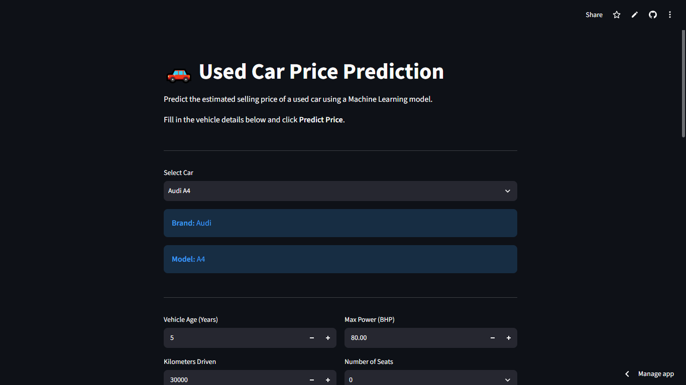
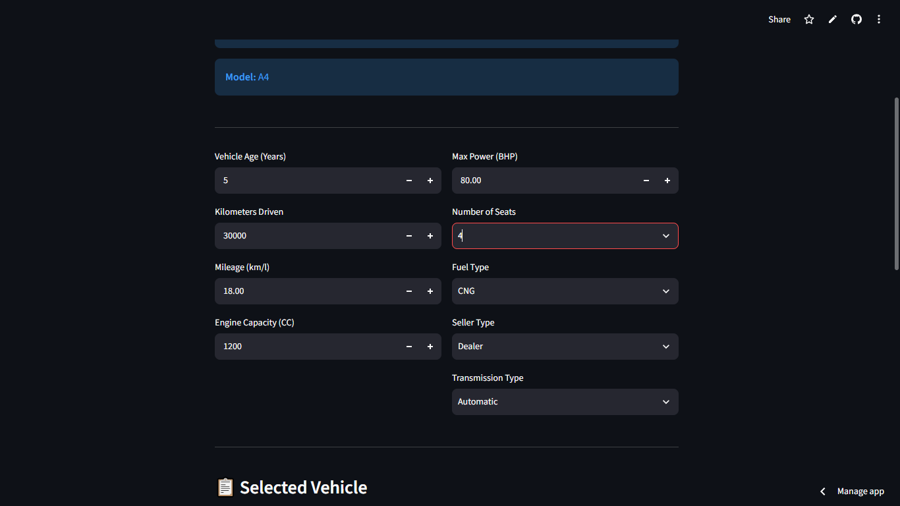
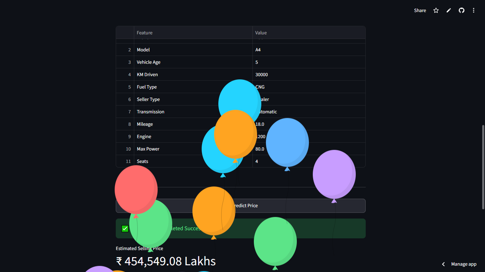

# 🚗 Used Car Price Prediction

**Name:** Abhijith A Kurup  
**MUID:** abhijitha-8@mulearn

---

## 📌 Project Overview

This project predicts the selling price of used cars using Machine Learning. The model is trained on historical used car data and deployed as an interactive web application using **Streamlit**.

Users can select a car model, enter vehicle details such as age, mileage, engine capacity, fuel type, transmission, and seller information to instantly receive an estimated selling price.

---

## 🚀 Live Demo

🌐 **Streamlit App**

https://car-price-prediction-gpabfug2pd5p2fi6egnexr.streamlit.app/

📂 **GitHub Repository**

https://github.com/dexter967/car-price-prediction

---

# 📸 Application Screenshots

## Home Page



---

## Vehicle Details



---

## Prediction Result



---

## 🛠 Technologies Used

- Python
- Pandas
- NumPy
- Scikit-Learn
- Streamlit
- Joblib

---

## 📊 Machine Learning Workflow

- Data Cleaning
- Missing Value Handling
- Feature Engineering
- Feature Encoding
- Decision Tree Regression
- Model Evaluation
- Model Serialization using Joblib
- Streamlit Deployment

---

## 📁 Project Structure

```
car-price-prediction/
│
├── app.py
├── car_price_prediction.ipynb
├── car_price_model.pkl
├── car_mapping.csv
├── options.json
├── requirements.txt
├── README.md
└── images/
      ├── home.png
      ├── details.png
      └── prediction.png
```

---

## ▶️ How to Run

Clone the repository

```bash
git clone https://github.com/dexter967/car-price-prediction.git
```

Go inside the project

```bash
cd car-price-prediction
```

Install dependencies

```bash
pip install -r requirements.txt
```

Run the Streamlit app

```bash
streamlit run app.py
```

---

## 📈 Features

- Interactive web interface
- Supports multiple car brands
- Automatic brand and model selection
- Real-time price prediction
- Decision Tree Regression model
- User-friendly interface
- Fully deployed on Streamlit Cloud

---

## 🎯 Model Information

**Algorithm Used**

- Decision Tree Regressor

**Input Features**

- Car Name
- Brand
- Model
- Vehicle Age
- Kilometers Driven
- Fuel Type
- Seller Type
- Transmission Type
- Mileage
- Engine Capacity
- Maximum Power
- Number of Seats

**Output**

- Estimated Selling Price

---

## 📌 Conclusion

This project demonstrates a complete Machine Learning pipeline—from preprocessing and model training to deployment with Streamlit. The application provides fast and interactive used car price predictions based on vehicle specifications.

---

## 👨‍💻 Developer

**Abhijith A Kurup**
